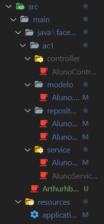
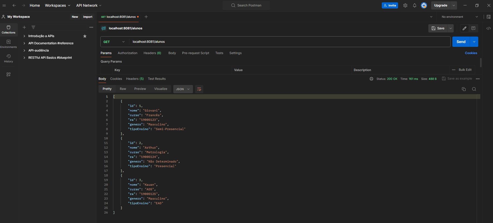
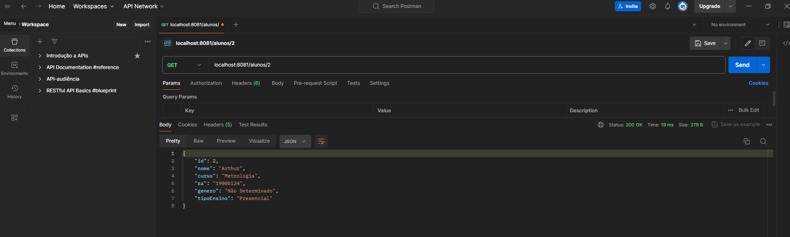
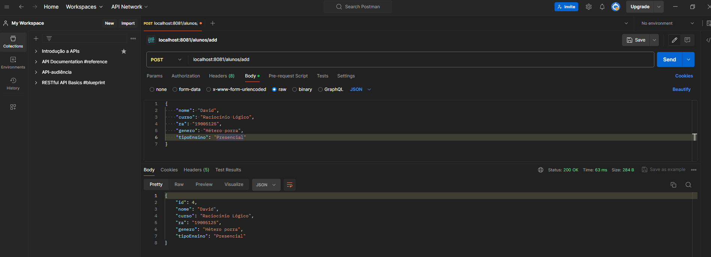

# ArquiteturaWebAC1

## Descrição

Aulas 3 e 4 da ac1 com prints mostrando a API via PostMan.

## Organização de pastas

## Método GET

### Requisição geral:

### Requisição por Id:

## Método POST:

## Publicação: https://github.com/ArthurBechir/ArquiteturaWebAC1

## Data de Publicação: 03/04/2024
